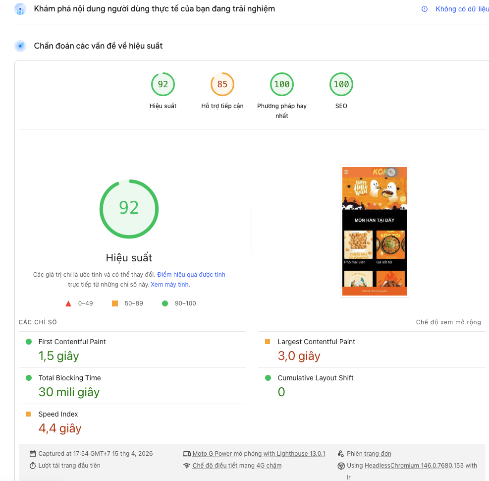

# Kokoria – Next.js Showcase

## Performance


## Overview
A sanitized demo version of a real-world restaurant website built with Next.js 15 and React 19.

The project focuses on performance, scalable architecture, and advanced caching strategies.

Sensitive business logic and APIs have been removed or replaced with mock data.

## Tech Stack
* Next.js 15 (App Router, Turbopack)
* React 19 + TypeScript
* Bootstrap, SCSS, Styled Components
* Framer Motion
* Axios, React Player

## Features
* Layout: sticky header, mobile navigation, hotline section, footer
* Home page: banner, product list, TikTok videos, store locations with map
* Contact page: image slider, business hours, contact form, content sections

## Performance
* Lazy loading images with Next.js Image
* Skeleton loading for better UX
* Image-first strategy for Google Maps

## Caching
* Server-side caching using unstable_cache
* Tag-based cache invalidation
* Manual cache reset via API
* Cache persists until backend data changes

## API & Error Handling
* Centralized service layer using Axios
* Global error handling strategy
* Prepared for Sentry integration

## Media

* TikTok thumbnails (mocked)
* Video rendering with React Player

## Structure
src/
 |-- actions/
 |-- app/
 |-- components/
 |-- helper/
 |-- hooks/
 |-- services/
 |-- styles/
 |-- types/

## Run locally
```bash
npm install
npm run dev
```

## Future Improvements
* AI chatbot integration
* Facebook feed integration
* Auto cache invalidation
* Performance optimization (90+ mobile target)

## Note
This repository is a demo version for showcase purposes only.
